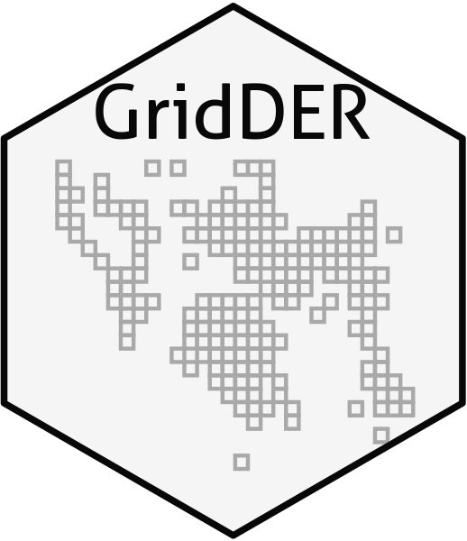
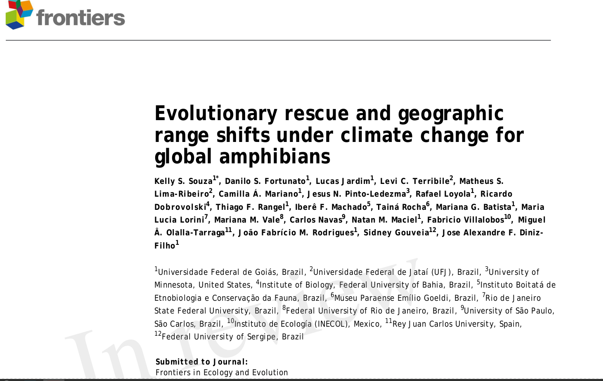
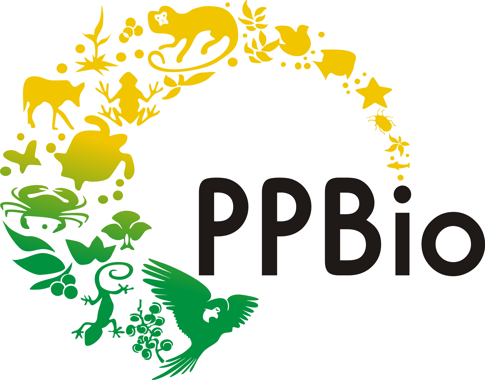

name: hello
class: middle, center, inverse


### `r rmarkdown::metadata$author`


### `r rmarkdown::metadata$role`

### `r rmarkdown::metadata$org`

[`r fontawesome::fa("github")` @Tai-Rocha](https://github.com/Tai-Rocha)    
[`r fontawesome::fa("twitter")` @Tai_Rocha_](https://twitter.com/Tai_Rocha_)   
[`r fontawesome::fa("link")` tainaweb-en.netlify.app](https://tainaweb-en.netlify.app/)

---
class: middle, center

# Research line and interests

.columns[

.left-col[
### Biodiversity and environmental data  <br> 
 <br>
Data cleaning <br> Spatial analysis through different statistical approaches (multivariate analysis and predictive models)

]

.middle-col[
### Bio(Eco)informatics 

<br>
Efficient tools for big data analysis. R tools, Earth Engine and QGIS. Linux  OS. Virtual Machines (Azure, Google Cloud, remote clusters)

]

.right-col[

### #opensci

 <br>
I am interested in good practices about open science, good workflows, reproducibility and FAIR principles.

]
]
---
class: top

### Selected work. Recent published or under review process.

- [Global land-use and land-cover (LULC) data under historical, current, and future climatic conditions, 2021](https://journals.ku.edu/jbi/article/view/15483/14122).

```{r resultsfig, echo=FALSE, fig.align='center', out.width="70%"}
knitr::include_graphics("images/results_main.png")
```


Main contributions: Conceptualization, developing R codes. Writing, review & editing the manuscript. 

---
### Selected work. Recent published or under review process.

- [GridDER: Grid Detection and Evaluation in R, 2022](https://ecoevorxiv.org/6qy5u/)

```{r gridder, echo=FALSE, fig.align='center', out.width="30%"}

```

Main contributions: Build an [R package](https://github.com/BiogeographyLab/gridder.github.io) and write the package documentation.

---
### Selected work. Recent published or under review process.

- Evolutionary rescue and geographic range shifts under climate change for global amphibians, 2022

Main contribution : Conceptualization, Data search & organization. Writing, review & editing the manuscript.

```{r front, echo=FALSE, fig.align='center', out.width="50%"}

```

---

### Current project

- Research Program on Biodiversity (PPBio)- Postdoc at the Eastern Amazon team

```{r ppbiologo, echo=FALSE, fig.align='center', out.width="45%"}

```

Main activity:  PPBio data search and organization. Data analysis. Working in collaboration with other PPBio teams.

---
name: hello
class:  middle, center, inverse


### `r rmarkdown::metadata$author`


### You can find more information on my CV and GitHub profile

### `r rmarkdown::metadata$org`

[`r fontawesome::fa("link")` CV](https://tai-rocha.github.io/Tai-Rocha_CV.github.io/) <br>
[`r fontawesome::fa("github")` @Tai-Rocha](https://github.com/Tai-Rocha)    
  

